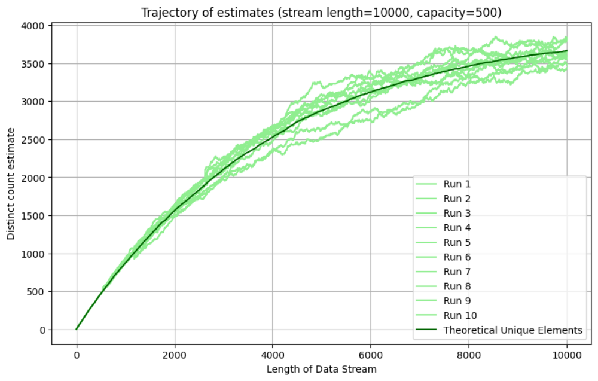
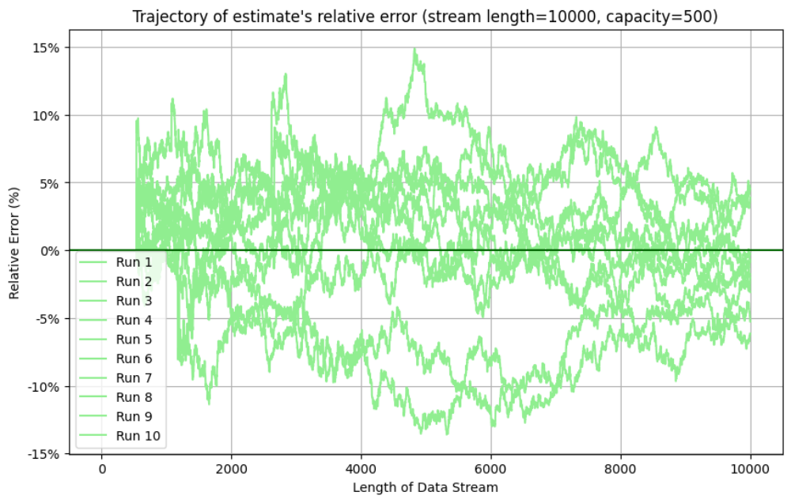

# Implementation of the CVM Algorithm to Estimate the Number of Distinct Elements in a Data Stream

## Overview
This project implements the CVM algorithm to estimate the number of distinct elements in a data stream. 
The algorithm is particularly useful for memory-constrained scenarios where the exact count is not necessary, 
but an approximate count within a certain error bound is sufficient. 

This implementation includes visualizations to compare the estimated counts with the theoretical counts and 
to analyze the relative error.





## References
This project stands on the following articles:
- "The CVM Algorithm for Estimating Distinct Elements in Streams" (Donald Knuth, 2023, [Link](https://www-cs-faculty.stanford.edu/~knuth/papers/cvm-note.pdf))
- "L'algorithme oublié" (Jean-Paul Delahaye, "Pour la science" from November 2024)
- "A simple probabilistic algorithm for estimating the number of distinct elements in a data stream" (Kenneth Tay, [Link](https://statisticaloddsandends.wordpress.com/2024/05/18/a-simple-probabilistic-algorithm-for-estimating-the-number-of-distinct-elements-in-a-data-stream/))

## Installation
To run this project, you need to have Python and the following libraries installed:
- `matplotlib`
- `numpy`

You can install the required libraries using pip:
```sh
pip install matplotlib numpy
```

## License
This project is licensed under the MIT License - see the [LICENSE](LICENSE) file for details.

